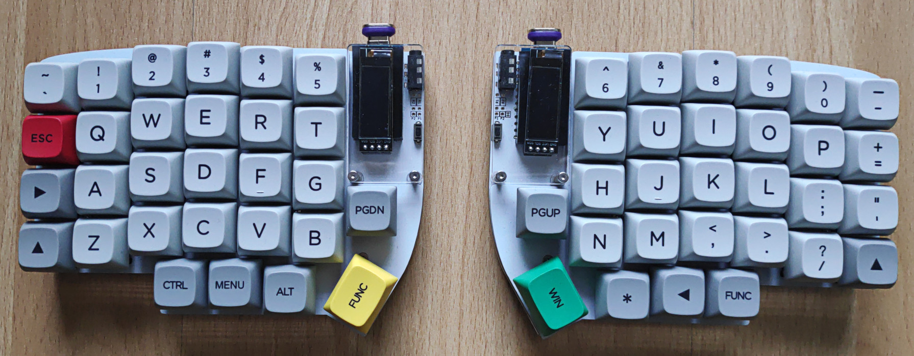

# Custom user keymap

This custom keymap is optimized for programming and typing US and German
language.
It is compatible with the US, US-International (with dead keys) and EurKEY
keyboard layouts.
If US-International (with dead keys) is chosen as OS keyboard layout, this
keymap resurrects the normally dead keys `` ` `` and `'`.
To type German "Umlauts" this keymap relies on the US-International (with dead
keys) or EurKEY OS keyboard layouts.
Both OS keyboard layout options exit because EurKEY might not be available on
all OS.

> NOTE:
> This custom keymap is for the Lily58 Pro Rev1 version, which has the QMK
> configuration name "rev1".
> The QMK build system only recognizes the rev1 name, hence the symlink `rev1`
> -> `pro_rev1` to make the version name unambiguous.



## Setup

Install and set up QMK according to documentation.
Then clone this repository and link it to QMK with:

```sh
git clone https://github.com/6arms1leg/qmk_userspace.git
cd qmk_userspace
qmk config user.overlay_dir="$(realpath .)"
```

## Configure

If the OS keyboard layout shall be EurKEY, chose and enable it in `config.h`:

```c
#define KEYMAP_EURKEY
```

This configures the keyboard so that it uses EurKEY keymap.
Otherwise, the US-International keymap is configured as default.

## Build

To compile and link this keymap, run:

```sh
qmk config user.keyboard=lily58/rev1
qmk config user.keymap=6arms1leg
qmk compile --compiledb
```

Or all in one step (without persistent QMK keyboard/keymap configuration):

```sh
qmk compile --compiledb -kb lily58/rev1 -km 6arms1leg
```

## Flash

Connect the keyboard half to be programmed and run:

```sh
qmk flash
```

## Set keyboard layout in OS

### Text console

The US-International or EurKEY keyboard layouts do not necessarily exit in the
text console of all OS.
However, in the text console these keyboard layouts are rarely necessary, and
using the default US keyboard layout is a safe choice with this keyboard to
accomplish all system level administration as German "Umlauts" are not needed.
Thus, the keyboard functions as a standard US keyboard, without German
"Umlauts".

To temporarily select the US keyboard layout in the system/text console, run:

```sh
sudo loadkeys us
```

This can be useful, e.g., if this keyboard is connected to a laptop with a
German keyboard layout, where the default text console keyboard layout shall
remain German and changed only if this external keyboard is connected.

To switch back, run:

```sh
sudo loadkeys de  # Or `defkeymap`
```

To make the change persistent for the system/text console, run:

```sh
sudo localectl set-keymap --no-convert us
```

To verify that the changes were made, run:

```sh
localectl status
```

### Desktop environment

To type German "Umlauts" either the US-International or EurKEY OS keyboard
layout must be chosen.

In Gnome, e.g., first run:

```sh
gsettings set org.gnome.desktop.input-sources show-all-sources true
```

This will enable all keyboard layouts in the settings option, including the ones
that might be hidden by default.

Then, go to

*Settings -> Keyboard -> Input Sources -> + Add Input Source -> English (United States)*

and select English (US, intl., with dead keys) and EurKEY (US).

## Set up keymap help

This keymap ships with a small helper script that parses the keymap
configuration that is flashed on the keyboard, and extracts and shows the keymap
ASCII-art comments for each layer.
This script can be symlinked into the `PATH` with:

```sh
ln -s \
    ${PATH_TO_QMK_USERSPACE_REPO}/keyboards/lily58/pro_rev1/keymaps/6arms1leg/extract_layouts_ascii_art.sh \
    ~/.local/bin/kbdh
```

Now, to show a keyboard help screen, run:

```sh
kbdh
```

in any terminal.
